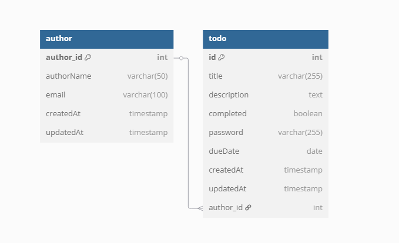
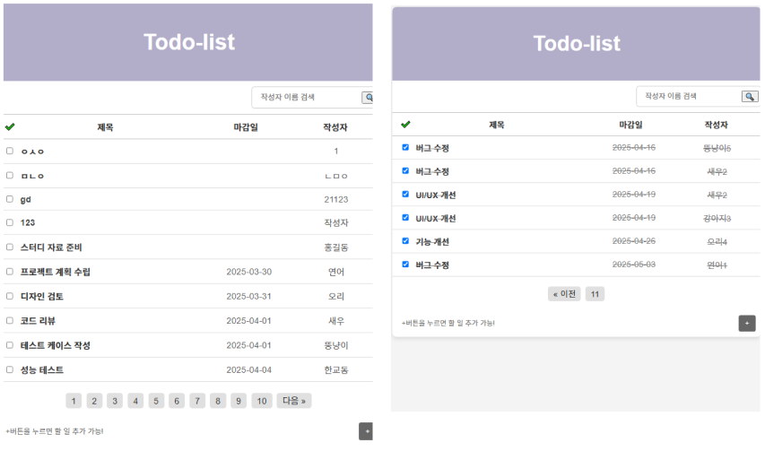
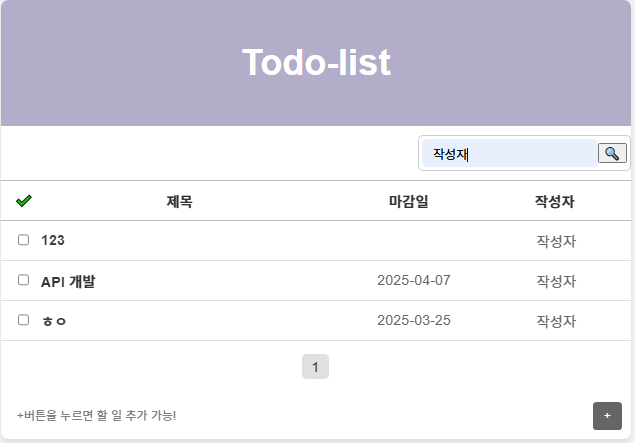
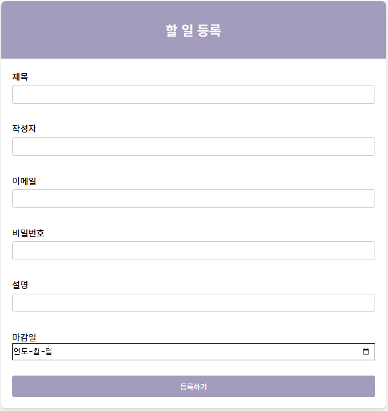
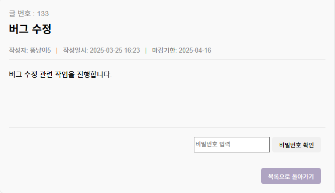
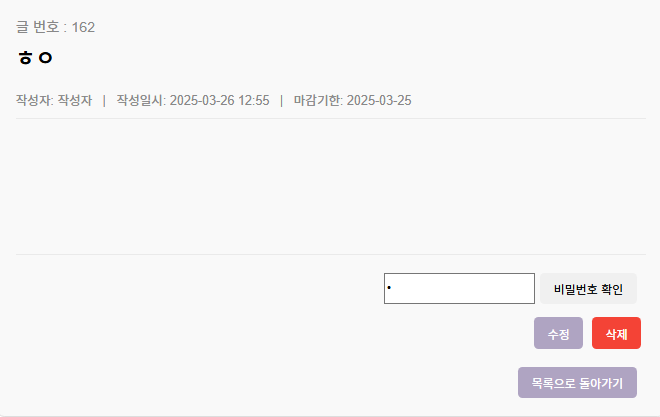
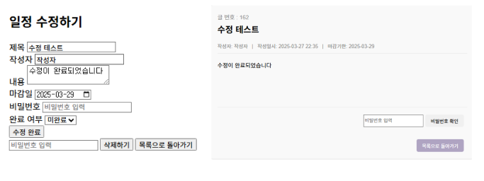

# 📅 TODO - 일정 관리 어플리케이션
TODO 는 일정관리 어플리케이션으로 CRUD 기능을 통해 일정의 생성, 조회, 수정, 삭제를 수행할 수 있습니다.
`JDBC`와  `3 Layer Architecture`를 적용하여 구현하였습니다.

###  💡 프로젝트 목표 
1. 구현하고자 하는 서비스의 전반적인 흐름을 이해하고 기능을 설계하기
2. API 명세서 작성하기
3. CRUD 기능이 포함된, REST API 구현하기
4. `3 Layer Architecture`에 따라 각 Layer의 목적에 맞게 프로젝트 개발하기
5. JDBC를 사용해 DB 연동과 기본적인 SQL 쿼리 작성에 익숙해지기

### 기술 스택
- Java 11
- JDBC Template
- MySQL
- Lombok
- Git & GitHub
- Gradle

## 📑 API 명세서

| 기능            | 메서드 | URL             | 요청 데이터 (Request)                                                                                      | 응답 데이터 (Response)                                                                                                                                                                                                                                                  | 상태 코드                   |
|----------------|-------|-----------------|-------------------------------------------------------------------------------------------------------|--------------------------------------------------------------------------------------------------------------------------------------------------------------------------------------------------------------------------------------------------------------------|-------------------------|
| **일정생성**   | POST  | `/api/todo`     | ```json { "title": "스터디 자료 준비", "authorName": "홍길동","password": "1234"  "content": "Java 자료 정리" } ``` | ```json { 일정이 성공적으로 추가되었습니다. TodoRequestDto(id=0, title=스터디 자료 준비, description=null, password=1234, completed=false, dueDate=null, updatedAt=2025-03-26T12:32:57.243260800, createdAt=2025-03-26T12:32:57.243260800, authorId=0, authorName=홍길동, email=null) } ``` | 201 정상등록 <br>400 등록실패   |
| **일정조회** | GET   | `/api/todo`      | 요청 파라미터 : ` page : 1,size : 10,authorName : 홍길동 (선택)` | ` json {"id": 1, "title": "프로젝트 계획 수립", "description": "팀과 함께 .", "dueDate": "2025-03-30", "completed": false, "createdAt": "2025-03-25T18:35:48", "updatedAt": "2025-03-25T18:35:48","authorId": 0,"authorName": "연어","email": null} `                            | 200 정상조회 404조회실패        | 200 정상조회  <br> 404 조회실패               |
| **상세조회** | GET   | `/api/todo/{id}` | 없음                                                                                                    | ``` json {"id": 52,  "title": "기능 개선", "description": null, "password": null, "completed": false, "dueDate": "2025-04-11", "updatedAt": "2025-03-25T20:45:21","createdAt": "2025-03-25T20:45:21","authorId": 0,"authorName": "연어1","email": null } ```             | 200 정상조회 <br> 404 조회실패  |
| **일정수정**   | PUT   | `/api/todo/{id}`          | ```json {"title": "회의 수정", "author": "홍길동", "password": "1234"} ```                                   | ```json {  } ```                                                                                                                                                                                                                                                   | 200 정상수정  <br> 404 수정실패 |
| **일정삭제**   | DELETE| `/api/todo/{id}`          | ```json {"password": "1234"} ```                                                                      | ```json {"message": "일정이 삭제되었습니다."} ```                                                                                                                                                                                                                            | 200 정상삭제 <br> 404 삭제실패  |

## ERD 


## 기능 소개
Todo List 프로젝트의 주요 기능을 소개합니다. 
#### 할일 조회 기능
- 모든 할 일을 조회할 수 있고, 페이지네이션이 적용되어 있습니다.
- 일정 목록은 마감 기한순으로 가까운 일정이 앞에 보이게, 마감 기한이 지난 일정이나 완료한 일정은 뒤에 보이게 정렬했습니다.

- 작성자 기준으로도 조회가 가능합니다.
 
#### 할일 추가 기능
- 할 일을 추가할 수 있으며 제목, 작성자, 마감일, 이메일, 비밀번호, 설명 등을 입력 가능합니다.
- 제목, 작성자, 비밀번호, 이메일은 필수로 입력해야 합니다.
- 목록 조회에서 + 버튼을 누르면 새 일정을 간편하게 만들 수 있습니다.


#### 할 일 상세 조회 기능
- 목록에서 제목을 클릭하면 해당 일정의 상세 정보를 확인할 수 있습니다.

- 비밀번호를 입력하고 올바른 값이 들어가면 수정/삭제 버튼이 뜹니다.

#### 할일 수정/삭제
- 상세 목록 조회 페이지에서 비밀번호 입력을 받아 일치하면 수정페이지로 이동합니다.
- 수정하기로 들어가서 한 번 더 비밀번호 입력을 하면 수정/삭제가 가능합니다.

